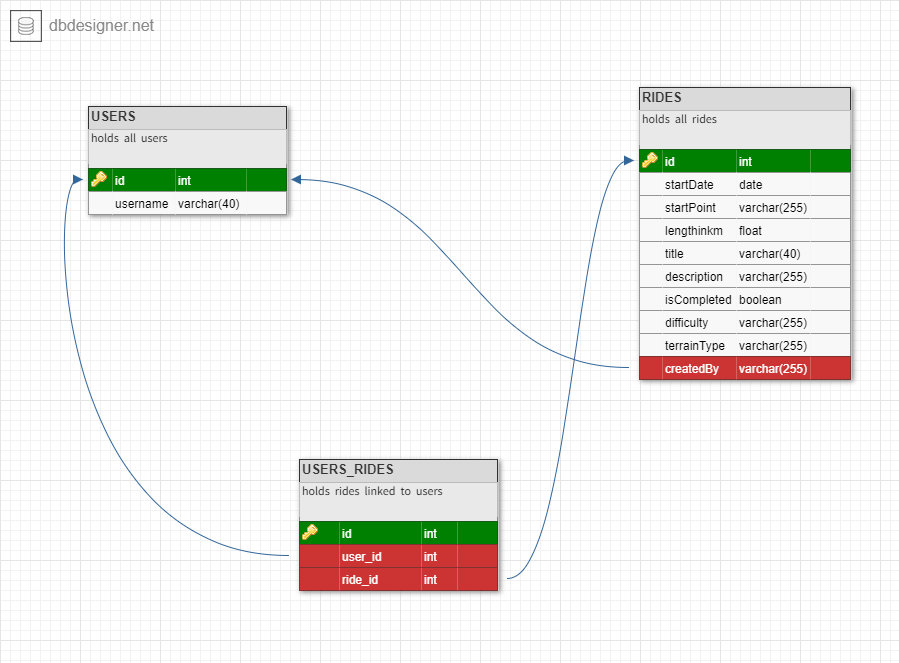

# cycling-buddy
 
 <https://docs.google.com/presentation/d/1mQFtX89DsIT5YCafigplt9XZvogWMxX9tsrrm4eRcyQ/edit?usp=sharing>

- [Database](#Database)
- [API routes](#API)
- [User flow](#User)

## Database-Schema

## API

<https://docs.google.com/document/d/1gxm5CfTIhLJPCBzmICJx_EHDeab0g4EItTrECJV7bXE/edit?usp=sharing>

## User

## Objectives

Create a marker on a map indicating the sites with bicycle availability.

_This is a student project that was created at [CodeOp](http://codeop.tech), a full stack development bootcamp in Barcelona._
